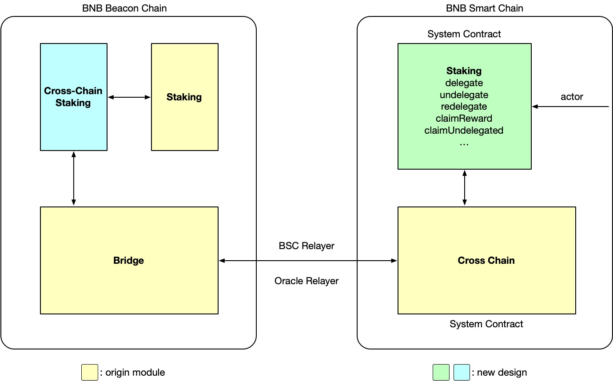
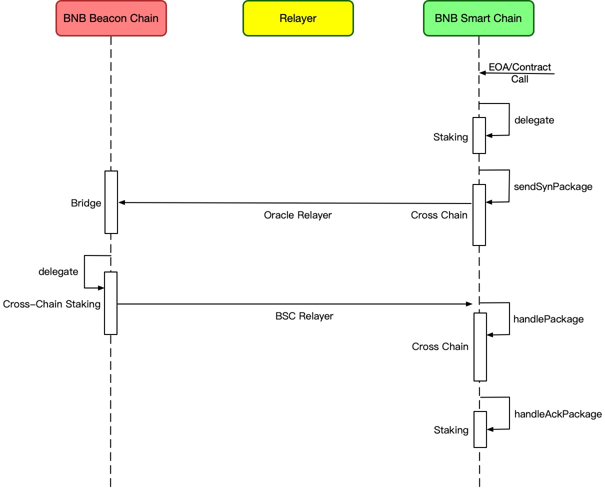

# BEP-153: Introduce Native Staking on BSC

- [BEP-153: Introduce Native Staking on BSC](https://github.com/bnb-chain/BEPs/pull/153)
    - [1. Summary](#1-summary)
    - [2. Abstract](#2-abstract)
    - [3. Status](#3-status)
    - [4. Motivation](#4motivation)
    - [5. Specification](#5-specification)
        - [5.1 Overview](#51-overview)
        - [5.2 Staking System Contract](#52-staking-system-contract)
          - [5.2.1 Cross-Chain Stake Event](#521-cross-chain-stake-event)
          - [5.2.2 Data Structs](#522-data-structs)
          - [5.2.3 Staking System Contract APIs](#523-staking-system-contract-apis)
        - [5.3 Cross-Chain Staking APP](#53-cross-chain-staking-app)
          - [5.3.1 Staking](#531-staking)
          - [5.3.2 Contract Address on BC(CAoB)](#532-contract-address-on-bccaob)
          - [5.3.3 Distribute Reward](#533-distribute-reward)
          - [5.3.4 Distribute Undelegated](#534-distribute-undelegated)
        - [5.4 Fees](#54-fees)
        - [5.5 Error Handle](#55-error-handle)
          - [5.5.1 Normal Error](#551-normal-error)
          - [5.5.2 Crash in Application Layer](#552-crash-in-application-layer)
          - [5.5.3 Error in Communication Layer](#553-error-in-communication-layer)
          - [5.5.4 How Funds are Handled When Errors Occur](#554-how-funds-are-handled-when-errors-occur)

## 1. Summary

This BEP introduces a native staking protocol onto BNB Smart Chain. With this BEP, individual or institution delegators can stake BNB to specified validators and get staking rewards on the BSC side directly.

## 2. Abstract

This BEP introduces a new staking system contract on the BSC side, all staking-related operations on the BSC side should be initiated through this contract, and then applied across-chain to BNB Beacon Chain through the native cross-chain communication mechanism. The cross-chain staking APP on the BNB Beacon Chain side reuses the previous staking mechanism to handle these staking-related operations.

The goals of this BEP is:

- For decentralized applications (dApps), they can launch their own staking services on the BSC side base on this protocol;
- For individuals, they can either directly stake their BNB through the staking system contract , or stake through the staking services provided by dApps on the BSC side.

## 3. Status

This BEP is a draft.

## 4.Motivation

Before this BEP, the BNB holders can only stake their assets on the BNB Beacon Chain. It means that if their assets are on the BNB Smart Chain, they have to transfer their assets across-chain to the BNB Beacon Chain first, which is not user-friendly enough.

With this BEP, the BNB holders can stake on the BSC directly, and dApps can launch their staking service based on the protocol introduced by this BEP, which can diversify the BSC ecosystem.

## 5. Specification

### 5.1 Overview



There are mainly four components:

1. Staking System Contract: A newly designed system contract in charge of handling staking requests on BSC.
2. Cross-Chain Communication: Existing cross-chain infrastructures including cross chain contract, relayer and oracle module on BC.
3. Cross-Chain Staking APP: A newly designed app on BC in charge of handling cross-chain staking requests.
4. Staking Module on BC: Existing infrastructure in charge of BC’s staking delegation.

### 5.2 Staking System Contract

This is a new system contract deployed on BSC. It fulfills all the basic functionalities of staking service including delegation, undelegation, claiming reward and redelegation. It receives requests, encapsulates data and sends cross-chain packages. Specifically, the cross-chain package is normalized as a Cross-Chain Stake Event as below.

#### 5.2.1 Cross-Chain Stake Event

The Cross-chain stake event will be emitted once a cross-chain stake transaction happens on BSC. It is mainly composed of channel ID, sequence ID and payload data.

The payload data is a sequence of RLP encoded bytes of {eventType, params}.

- eventType: uint8, will determine the corresponding handler that handles staking requests, and also determine how to decode the data. It includes the following types. 

    Among them, `distribute reward` and `distribute undelegated` events will be emitted initially on BC.

| Code  | 0x01     | 0x02       | 0x03       | 0x04              | 0x05                   |
|-------|----------|------------|------------|-------------------|------------------------|
| Event | Delegate | Undelegate | Redelegate | Distribute reward | Distribute undelegated |

- params: different requests have different parameters including but not limited to delegator address, staking amount, validator operator address and so on.

#### 5.2.2 Data Structs

To keep track of delegators requests and funds, we adopt multiple mappings to record data.

```solidity
mapping(address => uint256) delegated
mapping(address => mapping(address => uint256)) delegatedOfValidator
mapping(address => uint256) distributedReward
mapping(address => mapping(address => uint256)) pendingUndelegateTime
mapping(address => uint256) undelegated
mapping(address => mapping(address => mapping(address => uint256))) pendingRedelegateTime

mapping(address => uint256) delegateInFly
mapping(address => uint256) undelegateInFly
mapping(address => uint256) redelegateInFly
```
When a delegator submits request, his/her related record will not change at once. The state changes only after the request's ack package arrived.

- `delegated` records every delegator’s total staked amount. 

- `delegatedOfValidator` records every delegator’s staked amount to a specific validator.

- `distributedReward` records every delegator’s reward that has already been distributed to BSC.

- `pendingUndelegateTime`/`pendingRedelegateTime` records the estimated finish time of undelegation/redelegation. A new operation must wait until the previous operation is closed(the time is up or receive an ack/failack package). This record will not always be accurate. The request may close early.

- `undelegated` records every delegator’s unlocked undelegate funds(or failed delegation's funds) that has already been distributed to BSC.

- `delegateInFly`/`undelegateInFly`/`redelegateInFly` records the number of every delegator’s unfinished requests.

#### 5.2.3 Staking System Contract APIs

- `delegate(address validator, uint256 amount) payable`

    This method will handle the cross-chain delegating requests. Here, the `validator` represents the BC operator address of the validator to be delegated to. Cross-chain relayer fee should be included in the msg.value. The following graph represents the workflow of delegation on BSC:



- `undelegate(address validator, uint256 amount) payable`

    This method will handle the cross-chain undelegate requests. The staked BNBs on BC will be unlocked after 7 days and transferred to the staking contract on BSC automatically. Delegators could claim undelegated BNBs by `claimUndelegated`(see below). The `validator` represents the BC operator address of the validator delegated to. Cross-chain relayer fee should be included in the msg.value.

- `redelegate(address validatorSrc, address validatorDst, uint256 amount) payable`

    Undelegate amount BNBs from `validatorSrc` and delegate to `validatorDst`.

- `claimReward() returns(uint256 amount)`

    Delegators can claim their distributed reward by this method. The returned amount is the number of funds that `msg.sender` received.

- `claimUndelegated() returns(uint256 amount)`

    Delegators can claim their undelegated funds by this method. The returned amount is the number of funds that `msg.sender` received.

- `getDelegated(address delegator, address validator) external view returns(uint256 amount)`

  This function allows the delegator to query how much he/she has delegated to the specific validator.

- `getTotalDelegated(address delegator) external view returns(uint256 amount)`

  This function allows the delegator to query how much he/she has delegated in all.

- `getDistributedReward(address delegator) external view returns(uint256 amount)`

    This function allows the delegator to view the amount of the distributed rewards.

- `getPendingRedelegateTime(address delegator, address valSrc, address valDst) external view returns(uint256 amount)`

    This function allows the delegator to view the estimated finish time of redelegation from `valSrc` to `valDst`.

- `getPendingUndelegateTime(address delegator, address validator) external view returns(uint256 amount)`

    This function allows the delegator to view the estimated finish time of undelegation from `validator`.

- `getUndelegated(address delegator) external view returns(uint256 amount)`

    This function allows the delegator to view the amount of the undelegated funds.

- `function getRequestInFly(address delegator) override external view returns(uint256[3] memory)`

  This function allows the delegator to view how many requests in fly he/her has submitted. The three elements of the array represent delegate, undelegate and redelegate respectively.

### 5.3 Cross-Chain Staking APP

This is a new cross-chain app on BC side. It will be called by the BC’s bridge once it receives cross-chain staking packages. The main function of this app is to parse the data and do the staking related tasks.

#### 5.3.1 Staking

The native staking mechanism on the BC will stay almost the same as before. The only change is that the delegation will be tagged as native or none-native(cross-chain). The Cross-Chain Staking app will decode the cross-chain package depending on the event type code and call corresponding functions.

#### 5.3.2 Contract Address on BC(CAoB)

The delegator’s corresponding address on the BC will be the XOR result between a map hash of a specific constant string and its BSC address. So no one could control it except for the cross-chain app.

- The delegate CAoB is calculated by sha256("Staking Delegate Address Anchor") ^ BSC Address. This address is the counterpart of normal delegation’s delegator address. It’s used to hold the delegator’s staking funds.
- The reward CAoB is calculated by sha256("Staking Reward Address Anchor") ^ **delegate CAoB**. This address is used to hold the delegator’s reward. For convenience we add this extra address comparing to normal delegation.

#### 5.3.3 Distribute Reward

The delegation reward will be released at each breath block to the reward CAoB, once the balance of the reward CAoB is larger than a threshold. The reward will be cross-chain transferred to the staking system contract on the BSC side automatically. Please note that a proper cross chain relay fee will be charged so that the received reward on BSC will be slightly different.

#### 5.3.4 Distribute Undelegated

When undelegation finishes, the undelegated funds will be released to the stake CAoB address, and the funds of the stake CAoB will be cross-chain transferred to the staking system contract on the BSC side automatically in the next breath block. Please note that a proper cross chain relay fee will be charged so that the received undelegated BNB on BSC will be slightly different.

### 5.4 Fees

The fees charged for the relevant transactions are based on the following principles:

- For delegate, undelegate and redelegate, the gas and relayer fee(include oracle relayer fee and BSC relayer fee) shall be paid by the msg sender at once;
- For reward and undelegated distribution, the relayer fee will be deducted from users' funds.

### 5.5 Error Handle

This BEP will reuse the existing cross-chain infrastructure as much as possible. This includes and is not limited to the separation of application and communication protocol layers, uniform error handling principle and cross-chain application coding principle. As the new system contract BSC and new app on BC are all parts of the application layer, the error handling of the communication layer will remain the same as before.

#### 5.5.1 Normal Error

Normal errors means errors within expectations. For transactions that cross-chain communication is involved, all normal errors will be relayed back. We recommend that developers should check the returned reason for failure, modify the parameters and retry the transaction. Possible anticipated errors and success scenarios are listed below.

| Case                                                                                                       | BSC                                       | BC                                                                |
|------------------------------------------------------------------------------------------------------------|-------------------------------------------|-------------------------------------------------------------------|
| **1. Delegate 50 BNB**                                                                                     | Fail with amount less than minDelegation  | N/A                                                               |
| **2. Delegate/Redelegate to an nonexistent or jailed validator**                                           | Success                                   | Fail with invalid validator, send ackPackage with error to BSC    |
| **3. Delegates to ValA and before ackPackage returns**                                                     |                                           |                                                                   |
| a. Undelegate from A                                                                                       | Fail with insufficient balance            | N/A                                                               |
| b. Redelegate from A to B                                                                                  | Fail with insufficient balance            | N/A                                                               |
| **4. Already delegated 200 BNB to ValA**                                                                   |                                           |                                                                   |
| a. Undelegate 50 BNB from A                                                                                | Fail with amount less than minDelegation  | N/A                                                               |
| b. Undelegate 150 BNB from A successful and after lock time undelegate another 50 BNB from A               | Success                                   | N/A                                                               |
| c. Undelegate from A and left a balance of 0.004 BNB in A                                                  | Fail with balance less than bscRelayerFee | N/A                                                               |
| d. Redelegate 50 BNB from A to B                                                                           | Fail with amount less than minDelegation  | N/A                                                               |
| e. Redelegate 150 BNB from A to B successful and after lock time redelegate another 50 BNB from A to B     | Fail with amount less than minDelegation  | N/A                                                               |
| f. Redelegate from A to B and left a balance of 0.004 BNB in A                                             | Fail with balance less than bscRelayerFee | N/A                                                               |
| **5. Already delegated 100 BNB to ValA. Undelegate 100 BNB and before ackPackage returns**                 |                                           |                                                                   |
| a. Undelegate 100 BNB                                                                                      | Fail with pending undelegation            | N/A                                                               |
| b. Redelegate 100 BNB from A to B                                                                          | Success                                   | Fail with insufficient balance, send ackPackage with error to BSC |
| **6. Already delegated 100 BNB to ValA. Redelegate 100 BNB from A to B and before ackPackage returns**     |                                           |                                                                   |
| a. Undelegate 100 BNB from A                                                                               | Success                                   | Fail with insufficient balance, send ackPackage with error to BSC |
| b. Undelegate 100 BNB from B                                                                               | Fail with insufficient balance            | N/A                                                               |
| c. Redelegate 100 BNB from A to B                                                                          | Fail with pending redelegation            | N/A                                                               |
| d. Redelegate 100 BNB from A to C                                                                          | Success                                   | Fail with insufficient balance, send ackPackage with error to BSC |
| **7. Already delegated 100 BNB to ValA. Redelegate 100 BNB from A to B. Received ackPackage with success** |                                           |                                                                   |
| a. Undelegate 100 BNB from B                                                                               | Success                                   | Success                                                           |
| b. Redelegate 100 BNB from B to A                                                                          | Fail with pending redelegation            | N/A                                                               |
| c. Redelegate 100 BNB from B to C                                                                          | Success                                   | Success                                                           |

Therefore, if any errors happen on BSC, the transaction will be reverted and the msg sender will know it at once. But if an error happens on BC, the msg sender will not get feedback immediately. So we recommend dApp developers run some robots to monitor related events to get informed.

#### 5.5.2 Crash in Application Layer

The communication layer will catch the crash error of the application, record it in store or emit an event for debugging. The crash error will use the FAIL_ACK type of package if needed, and the payload of FAIL_ACK is the same as the payload of the SYNC package.

For contracts in BSC, the crash of Application will revert state change automatically, but for Application on BC we need to build another sandbox for it, only commit store after it did not crash.

When receiving the FAIL_ACK package, the communication layer will invoke a different method of Application, like handleFailAckPackage or ExecuteFailAckClaim. We will ensure the safety of users’ assets(see 5.5.4).

#### 5.5.3 Error in Communication Layer

Communication layer only plays around with these inputs: Type, Sequence, ChannelId, RelayerFee. The simplicity of these inputs helps us build a robust system.

However, once an error happens, the communication of a channel may be blocked. We have to hard fork the chain when errors occur in the communication layer.

#### 5.5.4 How Funds are Handled When Errors Occur During Delegation

It is very important to protect the safety of actors’ funds. As funds need to be transferred across the chain, this BEP will reuse the cross-chain transfer design as before. The key points are that funds transferred from BSC to BC will be locked in the tokenHub system contract and funds transferred from BC to BSC will be locked in the pegAccount. Necessary mechanism is employed to ensure the cross-chain reconciliation.

When a delegation request fails, an extra cross-chain package will be sent back to BSC. The funds will be unlocked from the tokenhub system contract, transferred to the staking system contract and be recorded as a part of the delegator’s pending undelegated. The delegator can get his/her funds back by claimUndelegated later. However, if the msg sender is a contract without a receive/fallback method, the transfer will fail and the funds may be lost forever. So **make sure your dApp implements the receive/fallback method**.

